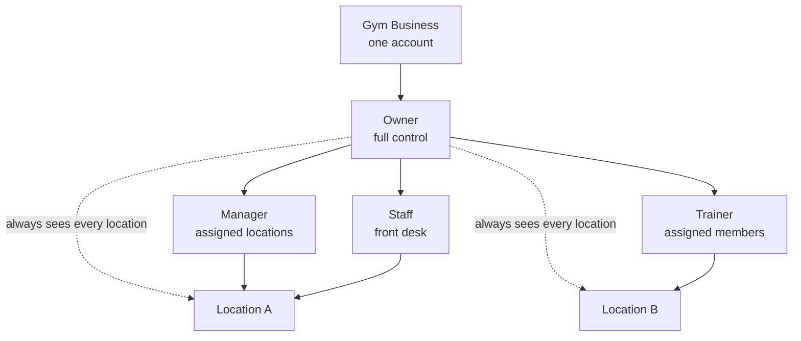
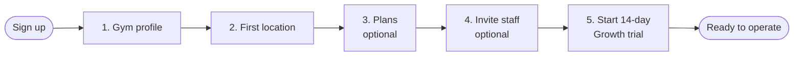
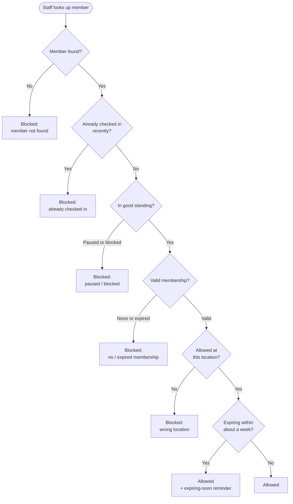
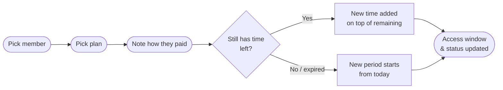
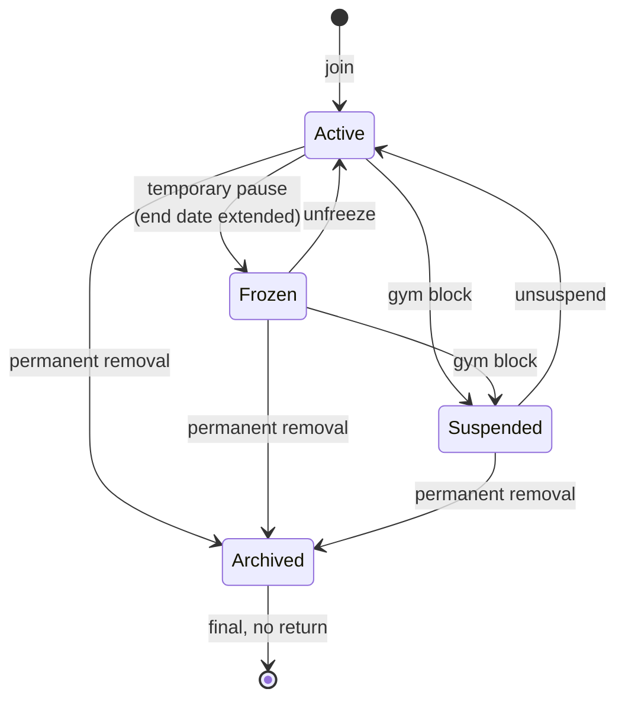
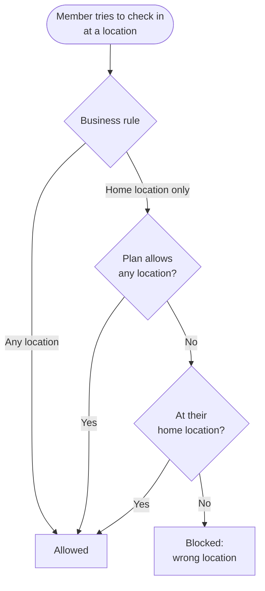

# FitnessOps — Business Overview (Non-Technical)

A plain-language guide to what FitnessOps does, who uses it, and how the day-to-day
workflows fit together. This document is written for owners, operators, investors,
and other non-technical stakeholders. It describes **business behavior and
workflows only** — no system internals.

For technical readers, the companion documents cover the engineering view:
`docs/diagrams-architecture.md`, `docs/diagrams-erd.md`, `docs/diagrams-class.md`,
`docs/diagrams-activity.md`, and `docs/prd.md`.

---

## 1. What FitnessOps is

FitnessOps is a subscription software product for growing gyms that want cleaner
daily operations and better visibility — without the complexity of enterprise gym
software.

It is best understood as an **operations visibility layer**, not a payment
processor and not an access-gate system. Gyms keep their existing payment methods
and their existing front desk. FitnessOps sits on top and answers the everyday
operational questions a gym owner and team care about:

- Who is an active member, and whose membership is expiring soon?
- Who needs a follow-up?
- Who checked in today?
- Which location is busy or needs attention?
- Is the front desk recording activity consistently?
- What is happening across the business right now?

### Guiding principles

| Principle | What it means for the business |
| --- | --- |
| Simple | Minimal learning curve for staff and owners |
| Fast | Front-desk check-in completes in seconds |
| Clear | Every screen answers one operational question |
| Location-aware | All data and metrics can be filtered by location |
| History-friendly | Operational history is always available, not an afterthought |
| Mobile-first | Designed for tablets and phones at the front desk |
| No hardware | Works with manual front-desk workflows; no gates or turnstiles required |
| No payment migration | Gyms keep their current way of taking payments |

### Who it is for

The ideal customer is a **growing independent gym with one to three locations**,
a staffed front desk, and manual or semi-manual operations — a business that wants
better visibility but is not ready for automated 24/7 gate systems or bloated
enterprise software. Best-fit examples include independent gyms, strength and
functional-fitness gyms, private training studios, small multi-location operators,
and walk-in gyms.

Primary markets are the United States, Canada, Australia, and the United Kingdom.
English is the primary language, with room to add more languages over time.

---

## 2. Who uses it — roles and access

FitnessOps organizes everything under a single business account (an
**Organization**). Each gym business is one organization, and every record —
members, payments, check-ins — belongs to it. One business never sees another
business's data.

Within a business there are four people-roles, each with a different level of
access:

| Role | What they can see and do |
| --- | --- |
| **Owner** | Full control of the whole business: all locations, billing, ownership, and staff. Exactly one owner per business at a time. |
| **Manager** | Operational management within the locations they are assigned to. |
| **Staff** | Day-to-day front-desk work — check-ins and member management — within assigned locations. |
| **Trainer** | Limited access to assigned members and their location context. |

The owner always has access to every location automatically. Managers, staff, and
trainers are each assigned to one or more specific locations and only work within
those. Ownership of the business can be transferred when needed, but there is
always exactly one active owner.

---

## 3. What you can do with it (capabilities at a glance)

- **Members** — maintain a member directory with status, contact details, home
  location, and membership history.
- **Memberships** — define membership plans (name, length, price) and record
  renewals as members pay.
- **Check-ins** — record member visits at the front desk in seconds, with
  automatic eligibility checks.
- **Follow-ups** — surface members who need attention (e.g. expiring soon).
- **Occupancy** — see an estimate of how busy each location is right now.
- **Reports** — review and export operational data (on eligible plans).
- **Locations (branches)** — manage multiple physical gym locations under one
  business.
- **Staff** — invite and manage team members and their roles.
- **Settings** — configure the gym profile, location settings, member access
  rules, and the FitnessOps subscription.

The sections below describe the workflows behind these capabilities.

---

## 4. Key workflows

### 4.1 Getting started (new gym onboarding)

When a new owner signs up, FitnessOps walks them through a short guided setup so
they can be operational quickly:

1. **Gym profile** — business name, timezone, and currency.
2. **First location** — name, address, and capacity.
3. **Membership plans** *(optional)* — set up the plans members can buy.
4. **Invite staff** *(optional)* — add team members by email and assign a role.
5. **Start trial** — begin a 14-day free trial of the Growth plan (a credit card
   is collected up front).
6. **Done** — a summary, with quick links to the dashboard or to add the first
   member.

The minimum to get going is the gym profile, the first location, and starting the
trial; the plan and staff steps can be completed later in Settings. Sensible
defaults are applied automatically (for example, members may check in at any
location unless the owner changes this later).

### 4.2 The front-desk check-in

Recording a visit is the most-used everyday workflow, and it is built to be fast —
a few seconds from looking up a member to confirming the check-in. Staff search
for the member and confirm; FitnessOps automatically checks whether the member is
eligible to enter and gives a clear yes/no answer.

A check-in is **allowed** when the member is in good standing, has a valid
membership, and is entitled to use that location. If the membership is close to
expiring (within about a week), the visit is still allowed but staff see a gentle
"expiring soon" reminder so they can prompt a renewal.

A check-in is **blocked**, with a clear reason, when:

- The member is already checked in (a repeat check-in within a short window).
- The membership is paused (frozen) or blocked (suspended).
- There is no active membership, or the membership has expired.
- The member is trying to enter a location they are not entitled to use.

These checks are firm — there is no manual override at the front desk — which
keeps entry decisions consistent and removes guesswork for staff. Archived members
are simply treated as "not found" so their history is never exposed at the desk.

### 4.3 Memberships and recording payments

FitnessOps does **not** process payments. Gyms continue to take money however they
do today (cash, card, transfer, and so on). What FitnessOps does is **record** the
membership and renewal so the member's access window and history stay accurate.

- **Membership plans** are reusable templates defined once for the business — a
  name, a length (for example 30 days), and a price.
- **Recording a renewal** is a simple workflow: pick the member, pick the plan,
  note how they paid, and confirm. FitnessOps then sets the member's new access
  window and updates their status automatically.
- **Fair renewal timing** — if a member renews while they still have time left,
  the new period is added on top of their remaining time rather than wasting it.
  If their membership has already lapsed, the new period starts from the day of
  payment.

Every plan's details are captured at the moment of purchase, so a member's history
stays accurate even if the plan's price or name changes later.

### 4.4 Member lifecycle and status

Each member has a clear status that controls whether they can check in:

| Status | Meaning | Who can set it |
| --- | --- | --- |
| **Active** | In good standing; can check in normally. | System / staff |
| **Frozen** | A temporary, member-requested pause. Their membership end date is automatically extended by the length of the freeze, so they don't lose paid time. Requires a reason and an end date. | Staff, manager, or owner |
| **Suspended** | A gym-initiated block (the membership end date does **not** extend). Requires a reason. | Manager or owner |
| **Archived** | A permanent removal. This is final — there is no return. | Owner only |

A few practical rules make this predictable:

- A frozen member can be reactivated (unfrozen) back to active.
- A suspended member can be reactivated (unsuspended) back to active.
- If a frozen member is suspended, the system tidies up the record so the history
  reads clearly, and once unsuspended the member returns to active.
- Archiving is permanent and reserved for the owner.

Conditions like "expiring soon," "expired," and "inactive" are not separate
statuses — they are simply derived from the membership end date or last visit, so
the team always sees an up-to-date picture without extra bookkeeping.

Every status change is recorded with who made it, when, and why, giving the
business a clear audit trail of how a member's standing has changed over time.

### 4.5 Locations and member access

A business can run multiple physical **locations** under one account. Locations
are used for check-ins and occupancy, reporting and performance comparison, staff
assignment, and a member's "home" location.

Member access across locations is configurable:

- **Any location** — the member can check in anywhere (the default).
- **Home location only** — the member can normally only check in at their home
  location. A specific membership plan can override this to allow any location.

This lets a single-site gym keep things simple while a multi-location business
controls exactly where each member is entitled to train.

---

## 5. Subscription plans and pricing

FitnessOps is sold to gyms as a monthly subscription. Billing, taxes, and payment
handling are managed through a trusted billing partner, so the gym owner simply
picks a plan and manages it from within FitnessOps.

| | Starter | Growth | Multi-Location |
| --- | --- | --- | --- |
| **Price** | $49/month | $89/month | $149/month |
| **Free trial** | — | 14-day free trial (card required) | — |
| **Locations** | 1 | 2 | 5+ ($39 per extra) |
| **Staff accounts** | 5 | 15 | Unlimited |
| **Member records** | Unlimited | Unlimited | Unlimited |
| Daily operations | Included | Included | Included |
| Check-ins & attendance | Included | Included | Included |
| Member & membership tracking | Included | Included | Included |
| Occupancy monitoring | Included | Included | Included |
| Download reports | — | Included | Included |
| Activity history | — | Included | Included |
| Compare location performance | — | — | Included |

Plain-language positioning:

- **Starter** — everything you need to run one gym, simply.
- **Growth** — more visibility and history, ready to grow. Includes the free trial.
- **Multi-Location** — full control across all your locations.

### How the trial works

Every new sign-up begins with a **14-day free trial of the Growth plan**. A card
is collected up front, and after the trial the plan renews automatically unless
changed. Owners can upgrade or downgrade during the trial. To keep things fair,
each email address is eligible for one trial.

### What happens at plan limits

Plans differ mainly by how many locations and staff accounts they allow, and by
which reporting features are included. The product handles limits gracefully:

- **Reaching a limit** shows a friendly notice (for example, on the locations or
  staff page).
- **Exceeding what a plan allows** prevents creating *new* items beyond the limit
  (a new location or new staff member) and suggests upgrading — but existing data
  always stays accessible.
- **Downgrading** never deletes anything. If the new plan allows fewer locations
  than the business currently has, those locations remain usable; the owner just
  can't add more until they upgrade again.

Discounts and promotional codes can be applied at checkout, and redemptions are
tracked for the business's own analytics.

---

## 6. Visibility — dashboard and reporting

Visibility is the heart of the product. From a single dashboard, the team can
filter by location and see the operational picture at a glance: who is active,
who is expiring soon, who needs follow-up, who checked in, and how busy each
location is.

Supporting views include:

- **Members** — the searchable member directory.
- **Memberships** — plans and renewals.
- **Check-ins** — the record of visits.
- **Follow-ups** — members who need attention.
- **Occupancy** — an estimate of how busy each location is right now.
- **Reports** — operational data that can be exported on eligible plans.
- **Branches (locations)**, **Staff**, and **Settings** — for running the business.

The experience is mobile-first so it works well on a tablet or phone at the front
desk, and notifications keep the team aware of things that need attention.

---

## 7. Communications

In its current form, FitnessOps focuses on essential, account-related emails
(such as those tied to signing in and managing the account) and an in-app
notification system that flags items needing attention. Broader member-messaging
features are planned for the future. Notifications and important account emails are
delivered reliably so the team stays informed.

---

## 8. What FitnessOps deliberately does not do

Being focused is part of the value. The product intentionally leaves out:

- **Payment processing** — gyms keep their existing payment methods; FitnessOps
  only records membership and renewal events.
- **Access hardware** — no gates, turnstiles, or 24/7 automated entry; the front
  desk runs check-ins manually.
- **Class booking and scheduling** — studios that revolve around class schedules
  (for example, certain Pilates or CrossFit studios) are not the target.
- **Enterprise gym chains** — the product targets growing independents, not large
  chains.

This keeps FitnessOps simple, fast, and easy to adopt for its target customer.

---

## 9. Glossary

| Term | Plain-language meaning |
| --- | --- |
| **Organization** | A single gym business account; the top level that owns all data. |
| **Branch / Location** | A physical gym location belonging to a business. |
| **Member** | A gym customer tracked in the system. |
| **Membership plan** | A reusable template for what a member buys: a name, length, and price. |
| **Membership period** | The window of time a member has paid-for access. |
| **Check-in** | A recorded member visit at the front desk. |
| **Occupancy** | An estimate of how busy a location is at the moment. |
| **Follow-up** | A flagged member who needs attention (e.g. expiring soon). |
| **Owner / Manager / Staff / Trainer** | The four people-roles, from full business control down to limited, location-specific access. |
| **Trial** | A 14-day free introduction to the Growth plan for new sign-ups. |
| **Frozen / Suspended / Archived** | Member states for a paused, blocked, or permanently removed membership. |

---

*This document describes business behavior and workflows only. For technical
detail, see the architecture and design documents referenced in the introduction.*
